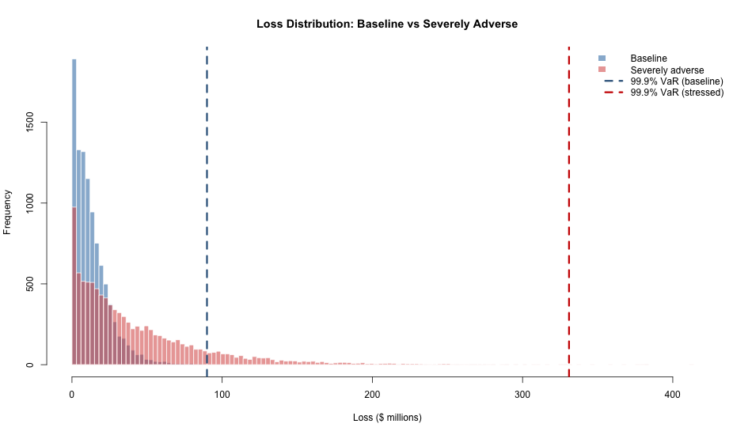

# Credit Portfolio Risk Model (R)

**Live interactive dashboard:** https://azhuk.shinyapps.io/credit-portfolio-risk/

Monte Carlo credit portfolio model built in R: expected loss, economic capital
via a one-factor Gaussian copula, and a DFAST-style severely adverse stress
scenario, wrapped in a deployed Shiny dashboard.

Built as a self-directed deep dive into credit portfolio modeling, implementing
the framework underlying the Basel IRB approach (BCBS, 2006).

## Key results

| Scenario | Expected Loss | 99.9% VaR | Economic Capital | Capital % of EAD |
|---|---|---|---|---|
| Baseline | $13.2M | $89.9M | $76.7M | 5.45% |
| Severely adverse | $43.4M | $330.9M | $287.5M | 20.43% |

Portfolio: 500 synthetic corporate loans, $1.4B EAD, S&P-style ratings AAA–CCC.
Severely adverse scenario: one-notch rating migration, LGD +15pts, asset
correlation 0.20 → 0.35.

## Method
- **PD** by rating (stylized long-run S&P-style default rates); **LGD** by
  collateral segment (25–90%); **EAD** = drawn + 75% CCF on undrawn revolvers
- **Correlated defaults:** one-factor Gaussian copula, asset correlation 0.20
  (within the Basel IRB corporate range of 0.12–0.24)
- **Capital:** 99.9% VaR minus expected loss (unexpected-loss standard)
- **Return on capital** by rating bucket, capital allocated by standalone UL

## Limitations
Flat asset correlation (IRB makes it PD-dependent); single-year horizon vs
DFAST's nine quarters; stylized PDs pending replacement with published S&P
default-study figures; segment and rating sampled independently; Gaussian
copula understates joint tail risk (t-copula noted as extension).

## Repo contents
- `credit_portfolio_model.Rmd` — full model with narrative (knitted HTML included)
- `shiny-app/app.R` — interactive dashboard (correlation slider, stress toggle)
- `output/` — generated charts and data

## Run it
Rmd: open in RStudio, Run All (base R only). App: `shiny::runApp("shiny-app")`.
